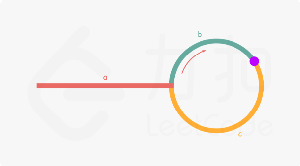

# 1.LeetCode
## 1.1两数之和
给定一个整数数组nums和一个整数目标值 target，请你在该数组中找出 和为目标值 target  的那 两个 整数，并返回它们的数组下标。

你可以假设每种输入只会对应一个答案。但是，数组中同一个元素在答案里不能重复出现。
你可以按任意顺序返回答案。

[链接网址 ctrl + 鼠标左键](https://leetcode.cn/problems/two-sum/)
### 解题
```java
public class Main {
    //主方法test
    public static void main(String[] args) {
        Main main = new Main();
        int[] nums = new int[]{3,2,4};
        for (int i : main.twoSum(nums, 6)) {
            System.out.println(i);
        }
    }
    public int[] twoSum(int[] nums, int target) {
        Map<Integer, Integer> map = new HashMap<Integer, Integer>();
        for (int i = 0; i < nums.length; i++) {
            //map中是否有 target - nums[i]的值，有就结束返回
            if (map.containsKey(target-nums[i]))
                //i是本次循环的数组下标，mao.get()的结果是（target - nums[i]）的下标
                return new int[]{i, map.get(target-nums[i])};
            //这样添加还有去重的作用
            map.put(nums[i], i);
        }
        return null;
    }
}
```
## 1.2两数相加
题目： 2.两数相加

链接：https://leetcode.cn/problems/add-two-numbers/

要求：给你两个非空 的链表，表示两个非负的整数。它们每位数字都是按照 逆序 的方式存储的，并且每个节点只能存储 一位 数字。

请你将两个数相加，并以相同形式返回一个表示和的链表。

你可以假设除了数字 0 之外，这两个数都不会以 0开头。

思路：不难所以见代码
### 解题
```java
public class Main {
    public static void main(String[] args) {
        Main main = new Main();
        ListNode l1 = new ListNode(9);
        ListNode current = l1;
        for (int i = 0; i < 1; i++) {
            current.next = new ListNode(9);
            current = current.next;
        }
        ListNode l2 = new ListNode(9);
        current = l2;
        for (int i = 0; i < 1; i++) {
            current.next = new ListNode(9);
            current = current.next;
        }
        ListNode res = main.addTwoNumbers(l1, l2);
        while (res != null) {
            System.out.print(res.val +" ");
            res = res.next;
        }
    }

    public ListNode addTwoNumbers(ListNode l1, ListNode l2) {
        ListNode head = new ListNode();
        ListNode current = head;
        int cry = 0;//进位
        int sum = cry;
        while (l1!=null || l2!=null || cry!=0 ) {
            sum = cry;
            if (l1 !=null) {
                sum += l1.val;//把节点中的数取出
                l1 = l1.next;
            }
            if (l2 !=null) {
                sum += l2.val;//把节点中的数取出
                l2 = l2.next;
            }
            current.next = new ListNode(sum%10);
            current = current.next;
            cry = sum/10;
        }
        return head.next;
    }
}
```
## 1.3 无重复字符的最长子串
题目：3. 无重复字符的最长子串

链接：https://leetcode.cn/problems/longest-substring-without-repeating-characters/

要求：给定一个字符串 s ，请你找出其中不含有重复字符的 最长子串 的长度。

### 解题:
```java
public class Main {
    public static void main(String[] args) {
        Main main = new Main();
        System.out.println(main.lengthOfLongestSubstring("abcabcbb"));
    }

    public int lengthOfLongestSubstring(String s) {
        //如果s长度为空直接返回
        if (s.length() == 0) return 0;
        //定义变量
        int left = 0;//无重复字符的起点
        int max = 0;//最长无重复字符数
        Map<Character, Integer> map = new HashMap<Character, Integer>();
        for (int i = 0; i < s.length(); i++) {
            char c = s.charAt(i);//获取字符串第i个位置的字符
            if (map.containsKey(c)) {
                /*
                    假如s = abccb
                    一直到第一个c left = 0，第二个c的时候 left = get(c)+1=3
                    执行到第二个b前 left = 3，然后 left = max(left, get(c))=max(3, 2)
                 */
                left = Math.max(left, map.get(c)+1);//修改起点（滑动）
            }
            map.put(c, i);//添加进map
            max = Math.max(max, i-left+1);
        }
        return max;
    }
 }
```

## 1.4
题目：4. 寻找两个正序数组的中位数

链接：https://leetcode.cn/problems/median-of-two-sorted-arrays/

要求：给定两个大小分别为 m 和 n 的正序（从小到大）数组nums1 和nums2。请你找出并返回这两个正序数组的 中位数 。
### 解题思路
其实我们可以用两个指针从小到大依次向后移

例如我有两个数组 nums1=[2, 3, 5] nums2=[1, 4, 7, 9] 结果为[1, 2, 3, 4, 5, 7, 9]答案显然是4

令 i 是num1的下标；j 是num2的下标；left为左值，right为right，left和right初值为-1

| 循环次数 | nums1[i] | nums2[j] | 大小关系 | left(=right) | right(=小的) | 操作(小的数组下标++) |
| -------- | -------- | -------- | -------- | ------------ | ------------ | -------------------- |
| 0        | 2        | 1        | 2 > 1    | -1           | 1            | j++                  |
| 1        | 2        | 4        | 2 < 4    | 1            | 2            | i++                  |
| 2        | 3        | 4        | 3 < 4    | 2            | 3            | i++                  |
| 3        | 5        | 4        | 5 > 4    | 3            | 4            | 结束 3 == (3+4)/2    |

代码：
```java
public class Main {
    public static void main(String[] args) {
        Main main = new Main();
        System.out.println(main.findMedianSortedArrays(new int[]{2, 3, 5}, new int[]{1, 4, 7, 9}));
    }
    public double findMedianSortedArrays(int[] nums1, int[] nums2) {
        //数组总长度
        int len = nums1.length + nums2.length;
        //指针
        int left = -1;
        int right = -1;
        int aStart = 0;//nums1数组的下标索引
        int bStart = 0;//nums2数组的下标索引
        for (int i = 0; i <= len / 2; i++) {
            left = right;
            if (aStart<nums1.length && (bStart >= nums2.length || nums1[aStart] < nums2[bStart])) {
                right = nums1[aStart++];
            }else {
                right = nums2[bStart++];
            }
        }
        return len%2 == 0? (left+right)/2.0 : right;
    }
}
```
## 1.5移动零
题目：移动零

链接：https://leetcode.cn/problems/move-zeroes/

要求： 给定一个数组 nums，编写一个函数将所有 0 移动到数组的末尾，同时保持非零元素的相对顺序。

注意：请注意 ，必须在不复制数组的情况下原地对数组进行操作。

```java
public class Main {
    public static void main(String[] args) {
        Main main = new Main();
        int[] arr = {1, 0, 3, 0, 12};
        main.moveZeroes(arr);
        System.out.println(Arrays.toString(arr));
    }

    public void moveZeroes(int[] nums) {
        int index = 0;
        for (int num : nums) {
            if (num!=0) {
                nums[index++] = num;
            }
        }
        while (index < nums.length) {
            nums[index++] = 0;
        }
    }
}
```
## 1.6 合并两个有序数组
题目：合并两个有序数组

链接：https://leetcode.cn/problems/merge-sorted-array/

要求：给你两个按 非递减顺序 排列的整数数组nums1 和 nums2 另有两个整数 m 和 n ，分别表示 nums1 和 nums2
中的元素数目。请你 合并 nums2 到 nums1 中，使合并后的数组同样按 非递减顺序 排列。

注意：最终，合并后数组不应由函数返回，而是存储在数组 nums1 中。为了应对这种情况，
nums1 的初始长度为 m + n，其中前 m 个元素表示应合并的元素，后 n 个元素为 0 ，应忽略。nums2 的长度为 n 。

**code:**
```java
public class Main {
    public static void main(String[] args) {
        Main main = new Main();
        int[] nums1 = {2, 0};
        int[] nums2 = {1};
        main.merge(nums1, 1, nums2, 1);
        System.out.println(Arrays.toString(nums1));
    }
    public void merge(int[] nums1, int m, int[] nums2, int n) {
        int aPoint = m-1;//nums1尾指针
        int bPoint = n-1;//nums2尾指针
        int putPoint = nums1.length-1;
        for (;putPoint >= 0; putPoint--) {
            if (aPoint >= 0 && (bPoint < 0 || nums1[aPoint] > nums2[bPoint])) {
                nums1[putPoint] = nums1[aPoint--];
            }else if(bPoint >= 0){
                nums1[putPoint] = nums2[bPoint--];
            }
        }
    }
}
```

## 1.7 找到数组中消失的数
题目：找到数组中消失的数

链接：https://leetcode.cn/problems/find-all-numbers-disappeared-in-an-array/

要求：给你一个含 n 个整数的数组 nums ，其中 nums[i] 在区间 [1, n] 内。请你找出所有在 [1, n] 范围内但没有出现在 nums 中的数字，并以数组的形式返回结果。

**code:**
```java
public class Main {
    public static void main(String[] args) {
        Main main = new Main();
//        int[] arr = {10,2,5,10,9,1,1,4,3,7};
        int[] arr = {4,3,2,7,8,2,3,1};
        System.out.println(main.findDisappearedNumbers1(arr));
    }
    public List<Integer> findDisappearedNumbers(int[] nums) {
        int len = nums.length;
        for (int num : nums) {
            nums[(num-1) % len]+= len;
        }
        List<Integer> list = new ArrayList<>();
        for (int i = 0; i < len; i++) {
            if (nums[i] <= len)
                list.add(i+1);
        }
        return list;
    }
    public List<Integer> findDisappearedNumbers1(int[] nums) {//速度慢
        for (int num : nums) {
            if (num < 0)
                num*=-1;
            if (nums[num-1]> 0)
                nums[num-1] *= -1;
        }
        List<Integer> list = new ArrayList<>();
        for (int i = 0; i < nums.length; i++) {
            if (nums[i] >  0)
                list.add(i+1);
        }
        return list;
    }
}
```

## 1.8 合并两个有序链表
题目：合并两个有序链表

链接：https://leetcode.cn/problems/merge-two-sorted-lists/

要求：将两个升序链表合并为一个新的 升序 链表并返回。新链表是通过拼接给定的两个链表的所有节点组成的。 

**code:**
```java
public class Main {
    public static void main(String[] args) {
        ListNode l1 = new ListNode(2);
        ListNode l2 = new ListNode(1);
        Main main = new Main();
        ListNode res = main.mergeTwoLists2(l1, l2);
        while (res != null) {
            System.out.println(res.val);
            res = res.next;
        }
    }
    public ListNode mergeTwoLists(ListNode list1, ListNode list2) {
        ListNode res = new ListNode();//新的头节点用于返回
        ListNode tem = res;//工作节点指针
        while (list1 != null || list2 != null) {
            if (list1!=null && (list2 == null || list1.val < list2.val)) {
                tem.next = list1;
                list1=list1.next;
            }else {
                tem.next = list2;
                list2 = list2.next;
            }
            tem = tem.next;//工作节点指针后移
        }
        return res.next;
    }

    public ListNode mergeTwoLists1(ListNode list1, ListNode list2) {
        //结束条件
        if (list1 == null)
            return list2;
        if (list2 == null)
            return list1;
        if (list1.val < list2.val) {
            list1.next = mergeTwoLists1(list1.next, list2);
            return list1;
        }
        list2.next = mergeTwoLists1(list1, list2.next);
        return list2;
    }
    public ListNode mergeTwoLists2(ListNode list1, ListNode list2) {
        ListNode res = new ListNode();
        ListNode tem = res;
        while (list1 != null && list2 != null) {
            if (list1.val < list2.val) {
                tem.next = list1;
                list1 = list1.next;
            }else {
                tem.next = list2;
                list2 = list2.next;
            }
            tem = tem.next;
        }
        if (list1 == null)
            tem.next = list2;
        if (list2 == null)
            tem.next = list1;
        return res.next;
    }
}
```

## 1.9 删除有序链表中的重复元素
题目：删除有序链表中的重复元素

链接：https://leetcode.cn/problems/remove-duplicates-from-sorted-list/

要求：给定一个已排序的链表的头 head ， 删除所有重复的元素，使每个元素只出现一次 。返回 已排序的链表 。

**code:**
```java
public class Main {
    public ListNode deleteDuplicates1(ListNode head) {
        if (head == null)
            return head;
        ListNode curr = head;
        while (curr.next != null) {
            if (curr.val == curr.next.val) {//当前节点的值等于下一个节点的值
                curr.next = curr.next.next;
            }else
                curr = curr.next;
        }
        return head;
    }
    public ListNode deleteDuplicates(ListNode head) {
        if ( head == null || head.next == null)
            return head;
        head.next = deleteDuplicates(head.next);
        return head.val == head.next.val ? head.next : head;
    }
}
```

## 1.10 删除链表中的重复元素||
题目：删除链表中重复的元素||

链接：https://leetcode.cn/problems/remove-duplicates-from-sorted-list-ii/

要求：给定一个已排序的链表的头 head ， 删除原始链表中所有重复数字的节点，只留下不同的数字 。返回 已排序的链表 。

**工具类**
```java
public class ListNodeUtil {
    public static Scanner scanner = new Scanner(System.in);
    public static ListNode initLinked() {
        ListNode head = new ListNode();
        ListNode cur = head;
        int len = scanner.nextInt();
        for (int i = 0; i < len; i++) {
            int n = scanner.nextInt();
            cur.next = new ListNode(n);
            cur = cur.next;
        }
        return head.next;
    }
    public static void printLinkedList(ListNode head) {
        while (head != null) {
            System.out.println(head.val);
            head = head.next;
        }
    }
}
```
**code:**
```java
public class Main {
    public static void main(String[] args) {
        Main main = new Main();
        ListNode head = LinkedList.initLinked();
        ListNode listNode = main.deleteDuplicates(head);
        LinkedList.printLinkedList(listNode);
    }
    public ListNode deleteDuplicates(ListNode head) {
        if (head == null)
            return head;
        ListNode res = new ListNode();
        ListNode temp = res;
        ListNode cur = head;
        int prev = Integer.MIN_VALUE;
        while (cur != null) {
            if (cur.val == prev) {
                cur = cur.next;
                continue;
            }
            if (cur.next != null && cur.val == cur.next.val) {
                prev = cur.val;
                cur = cur.next;
                continue;
            }
            temp.next = new ListNode(cur.val);
            temp = temp.next;
            cur = cur.next;
        }
        return res.next;
    }
}
```

## 1.11 环形链表
题目：环形链表

链接：https://leetcode.cn/problems/linked-list-cycle/

要求：给你一个链表的头节点 head ，判断链表中是否有环。

如果链表中有某个节点，可以通过连续跟踪 next 指针再次到达，则链表中存在环。 为了表示给定链表中的环，
评测系统内部使用整数 pos 来表示链表尾连接到链表中的位置（索引从 0 开始）。注意：pos 不作为参数进行传递。
仅仅是为了标识链表的实际情况。

如果链表中存在环，则返回 true 。 否则，返回 false 。

**解题思路**
- 使用map结构来解决(containKey()方法)
- 使用快慢指针，如果存在环，那一定会相遇（速度不同，定相遇）

**code:**
```java
public class Main {
    public boolean hasCycle(ListNode head) {
        if (head == null)
            return false;
        ListNode slowP = head;
        ListNode fastP = head;
        //在一个环中，速度不同一定会相遇
        while (fastP.next != null && fastP.next.next != null) {//结束以快指针为准，它不为null，慢指针也不会为null
            slowP = slowP.next;
            fastP = fastP.next.next;
            if (slowP == fastP)
                return true;
        }
        return false;
    }
}
```
## 1.12 环形链表
题目：环形链表||

链接：https://leetcode.cn/problems/linked-list-cycle-ii/

要求：给定一个链表的头节点 head，返回链表开始入环的第一个节点。如果链表无环，则返回null。

如果链表中有某个节点，可以通过连续跟踪 next 指针再次到达，则链表中存在环。 为了表示给定链表中的环，
评测系统内部使用整数 pos 来表示链表尾连接到链表中的位置（索引从 0 开始）。如果 pos 是 -1，则在该链表中没有环。
注意：pos 不作为参数进行传递，仅仅是为了标识链表的实际情况。

不允许修改 链表。

**思路**

设如果存在环形链表，他的结构为：a+b+c
- a：环前节点数
- b：相遇节点数（从a后开始算）
- c：环剩余部分（从b后开始算） 

步数关系 s= a+b   f=2s=2(a+b)=a+n(b+c)+b
        
    f=a+n圈(b+c)+b(重合点)
得：a = c + (n-1)(b+c)
**code:**
```java
public class Main {
    public ListNode detectCycle(ListNode head) {
        if (head == null)
            return null;
        ListNode fast = head, slow = head;
        boolean isMeet = false;
        while (fast.next != null && fast.next.next != null) {
            fast = fast.next.next;
            slow = slow.next;
            if (fast == slow) { //如果相遇设置相遇标识
                isMeet = true;
                break;
            }
        }
        if (isMeet) {
            fast = head;//fast从头开始
            while (fast != slow) {
                fast = fast.next;
                slow = slow.next;
            }
            return fast;
        }
        return null;
    }
}
```

